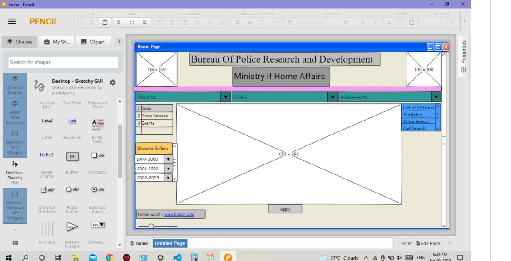

# Wire frame for a website

## AIM:
To design a wire frame for a website.

## DESIGN STEPS:

### Step 1:
install pencil application

### Step 2:
using tools create design

## OUTPUT:

## Result:
Thus a wire frame is designed for a given website.
